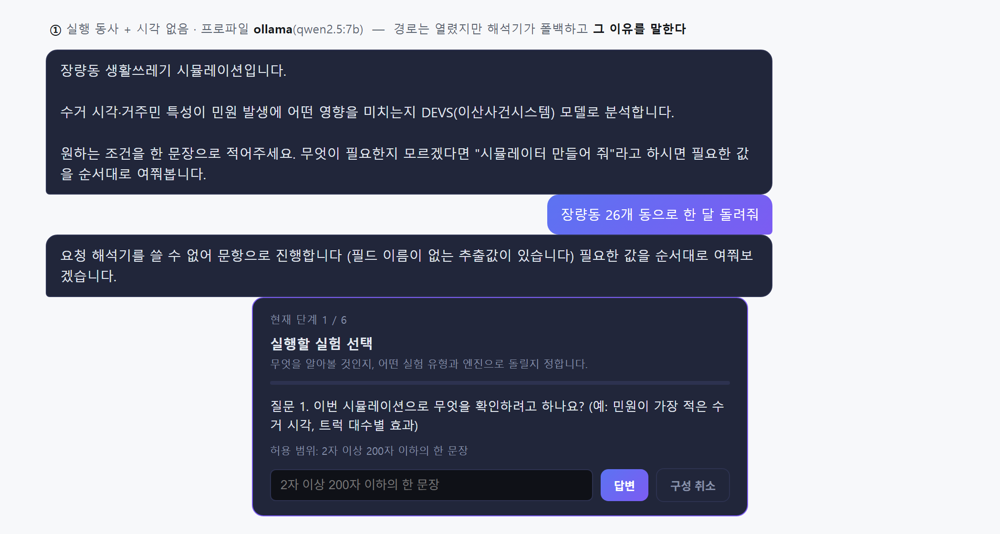
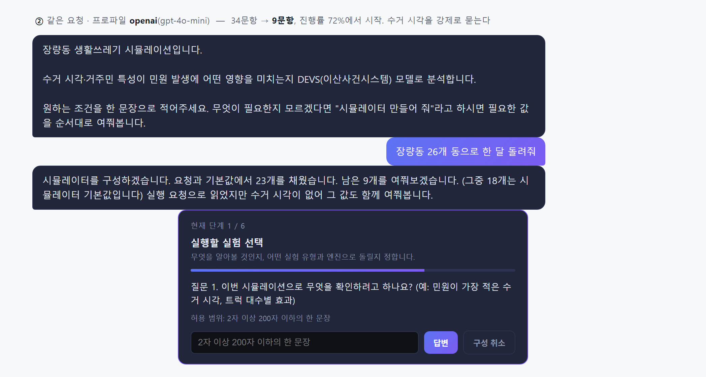
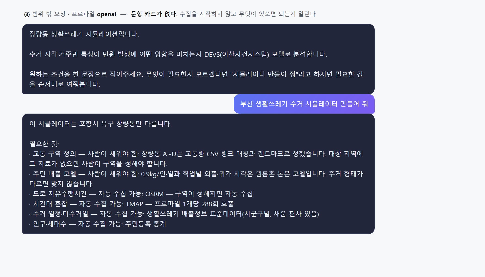

# 채팅 UI 실행 기록 — 실행 동사 경로와 거부 경로

2026-09-11 · 기준 커밋 `8b3d67f` + **미커밋 변경 있음**(아래 참조)

`05bb4ee`에서 만든 **실행 동사 경로**를 실제 앱에서 처음 돌린 기록이다. 같은 요청을 로컬
모델과 OpenAI 두 프로파일로 돌려 무엇이 갈리는지 함께 담았다.

## 이 기록의 성격

앱을 띄워 채팅 UI를 실제로 조작했고, **브라우저에 렌더된 `#messages` DOM을 앱의 CSS와 함께
굳혀** PNG로 뽑았다. 화면에 보이는 말풍선·문항 카드·진행률 막대는 모두 실제 렌더 결과다.
전체 창(입력칸·결과 패널)이 아니라 대화 영역만 담았다.

`docs/reports/llm-blueprint-capture-2026-09-06/`는 같은 방식의 HTML만 남겼다. 이번에는 PNG를
함께 만들었다 — 발표 자료에 바로 넣을 수 있다.

## 실행 환경

| | |
|---|---|
| 주소 | `http://localhost:8090` |
| 프로파일 ① | `ollama` · 해석기 `qwen2.5:7b` (`localhost:11434`) |
| 프로파일 ②③ | `openai` · 해석기 `gpt-4o-mini` |
| 문항 세트 | v4 |
| 실행 방법 | `.claude/launch.json`의 `waste-sim` / `waste-sim-openai` |

**미커밋 변경 위에서 돌렸다.** 다른 세션이 작업 중인 `BlueprintComposer.java`·
`JangnyangSubtaskDefinition.java`·`jangnyang-simulator-v4.json`·신규 `InvalidValuePolicy.java`가
작업 트리에 있다. 그래서 채운 개수가 2026-09-06 기록(24개 채움/9개 남음/19개 기본값)과 다르다 —
아래 ②는 **23/9/18**이다. 커밋 후 다시 재면 또 달라질 수 있다.

## ① 실행 동사 + 시각 없음 — 로컬 모델

입력: **"장량동 26개 동으로 한 달 돌려줘"**



**경로가 열린 것이 요점이다.** `05bb4ee` 이전에는 이 문장이 일반 답변으로 떨어졌다 — 즉시 실행
게이트는 시각이 정확히 1개일 것을 요구하고(여기엔 0개), 생성 판별기는 "돌려"를 일부러
제외했기 때문이다. 이제 수집으로 들어온다.

**그리고 해석기가 폴백했다.** `qwen2.5:7b`가 필드 이름 없는 추출값을 내서
`requireWellFormed`가 전체를 버렸고, 문항 흐름으로 넘어가며 **그 이유를 화면에 말한다** —

> 요청 해석기를 쓸 수 없어 문항으로 진행합니다 (필드 이름이 없는 추출값이 있습니다)

이 문구가 보이는 것 자체가 `faf2efd`의 수정이 살아 있다는 증거다. 그 전에는 문항 카드의
`content`에 실려 나가 화면이 그리지 않았고, 해석기가 매번 죽는데도 아무도 몰랐다.

진행률 막대가 **0%**다. 채운 값이 없으니 34문항을 처음부터 묻는다.

## ② 같은 요청 — OpenAI

입력: 같음. 프로파일만 `openai`.



```
시뮬레이터를 구성하겠습니다. 요청과 기본값에서 23개를 채웠습니다.
남은 9개를 여쭤보겠습니다. (그중 18개는 시뮬레이터 기본값입니다)
실행 요청으로 읽었지만 수거 시각이 없어 그 값도 함께 여쭤봅니다.
```

**34문항 → 9문항.** 진행률 막대가 72%에서 시작하는 것이 그 비율이다.

마지막 문장이 `05bb4ee`에서 넣은 것이다. 실행 동사 경로로 들어왔을 때만 붙고,
`collectionTime`을 `GapResolver`의 `alwaysAsk`로 넘겨 **근거가 있어도 채우지 않고 묻게** 한다.
이 경로에서 사용자가 정하려던 유일한 값이 시각이기 때문이다.

**①과 ②의 차이는 모델뿐이다.** 프롬프트도 문항 세트도 코드도 같다. 같은 배선이 해석기 성능에
따라 9문항이 되거나 34문항이 된다 — 그리고 34문항이 될 때는 조용히 그러지 않는다.

## ③ 범위 밖 요청 — 거부

입력: **"부산 생활쓰레기 수거 시뮬레이터 만들어 줘"**



**문항 카드가 없다.** 수집을 시작하지 않았다는 증거다. 배선 전에는 "부산"에도 장량동 34문항을
처음부터 물었고, 사용자는 34개를 답한 뒤에야 자기 요청이 애초에 불가능했다는 것을 알게 됐다.

거부가 **무엇이 있으면 되는지**를 함께 낸다. 자동 수집 가능한 넷(OSRM·TMAP·표준데이터·주민등록
통계)과 사람이 채워야 하는 둘(교통 구역 정의·주민 배출 모델)이 갈려 있다. 후자를 감추면 전부
자동으로 될 것처럼 읽힌다.

## 확인하지 못한 것

- **9문항을 끝까지 답해 실행까지 가지 않았다.** 미리보기·실행·결과 카드는 v3 기록
  (`subtask-v3-capture-2026-09-03`)이 담고 있었으나 그 PNG들은 현재 작업 트리에서 삭제 대기
  상태다(`git status`에 `D`로 있다). 결과 화면 캡처가 필요하면 따로 돌려야 한다.
- **`collectionTime`이 실제로 남은 9문항 안에 있는지 문항을 밟아 확인하지 않았다.** 안내 문구와
  `GapResolver`의 `alwaysAsk` 경로, 그리고 `BlueprintComposerTest.anAlwaysAskFieldIsNotCountedAsFilled`가
  그것을 고정하지만, UI에서 그 질문이 뜨는 장면은 담지 못했다.
- **①의 폴백은 재현을 보장하지 못한다.** `qwen2.5:7b`가 매번 같은 형태로 실패하지는 않는다.
  그 실패가 고정된 사실이라기보다 이번 실행에서 관측된 것으로 읽어야 한다.

## 곁들여 바꾼 것

`.claude/launch.json`(저장소 루트)에 **`waste-sim-openai`** 설정을 추가했다 — `openai` 프로파일로
띄우는 항목이 없어서 ②③을 돌릴 수 없었다. 기존 항목과 같은 형식(`-f waste-sim-spring/pom.xml`)을
따랐고 포트도 8090이다.

## 파일

| 파일 | 내용 |
|---|---|
| `01-run-verb-fallback.png` / `.html` | ① 로컬 모델, 폴백 |
| `02-run-verb-composed.png` / `.html` | ② OpenAI, 34→9문항 |
| `03-refusal.png` / `.html` | ③ 범위 밖 거부 |

HTML은 앱 CSS를 인라인으로 품고 있어 브라우저로 열면 그대로 재현된다. 문구를 고쳐 PNG를 다시
뽑을 때 쓴다.
