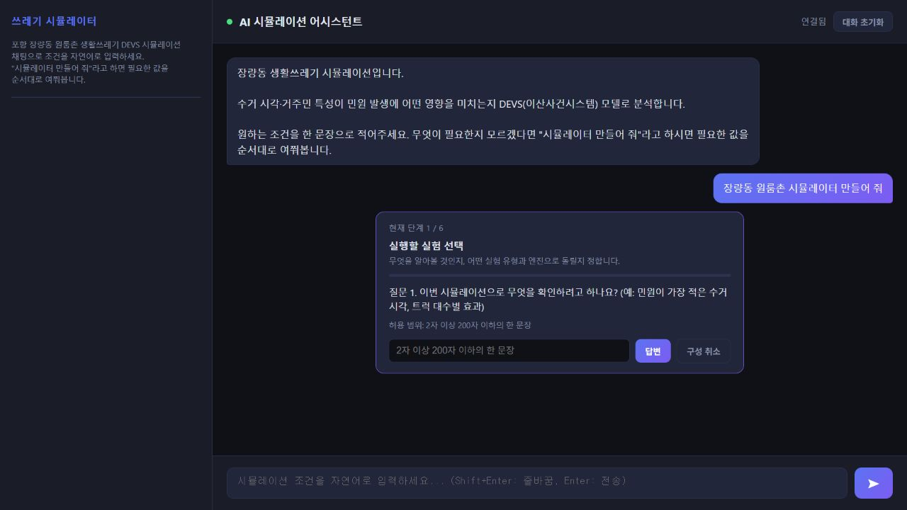
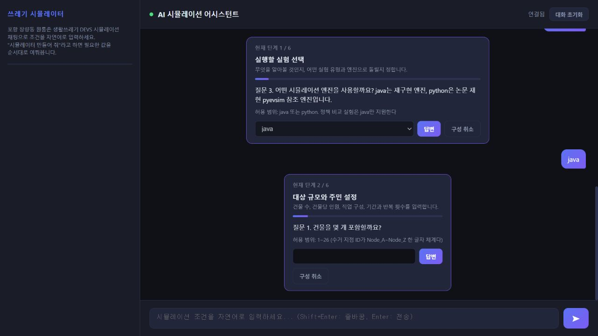
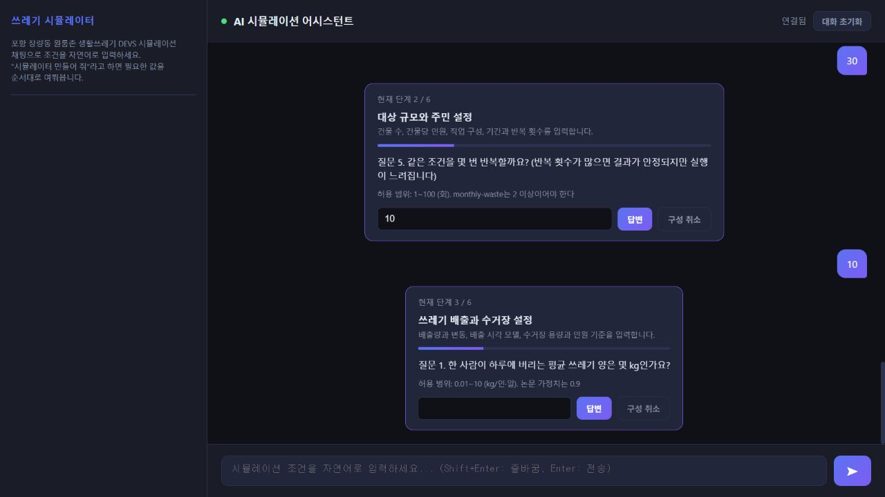
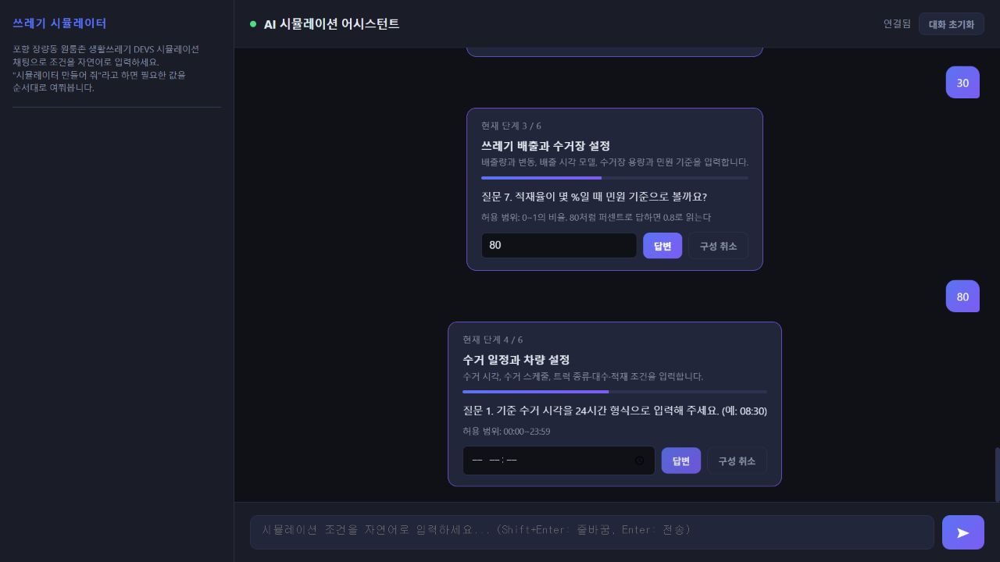
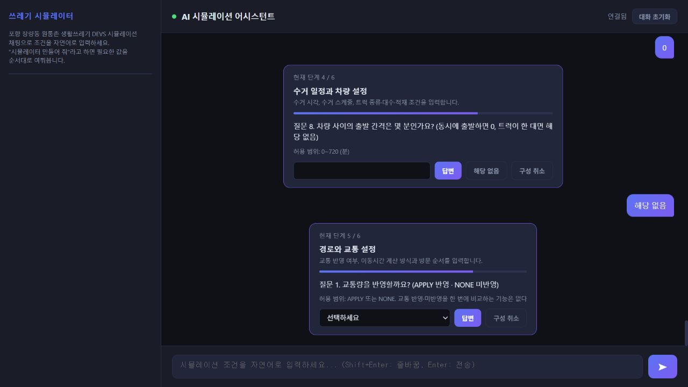
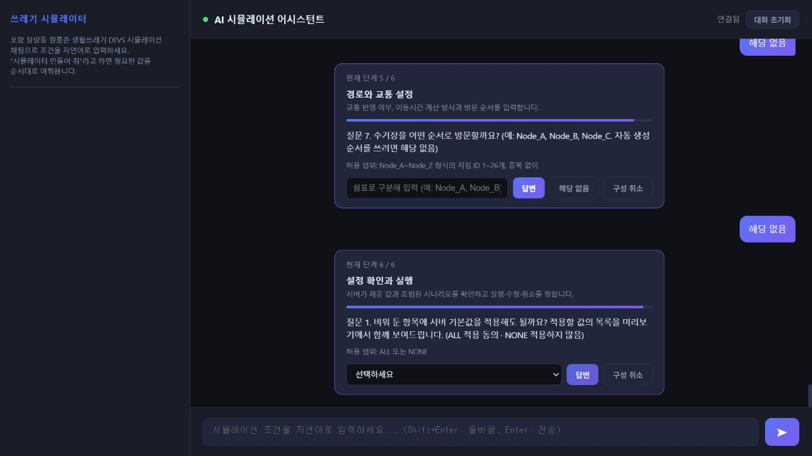
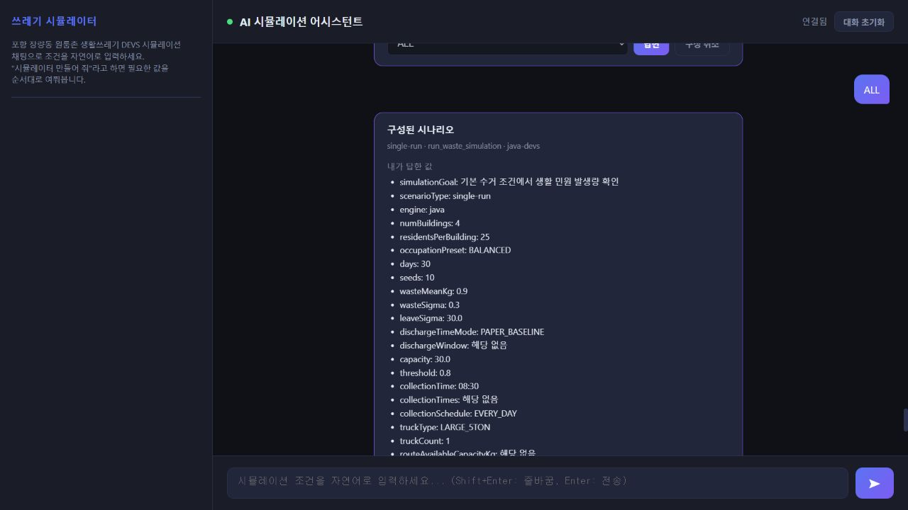
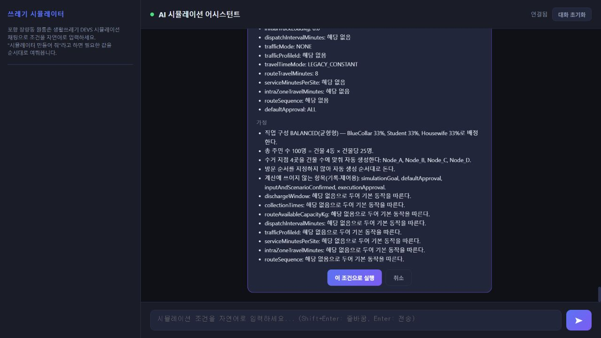
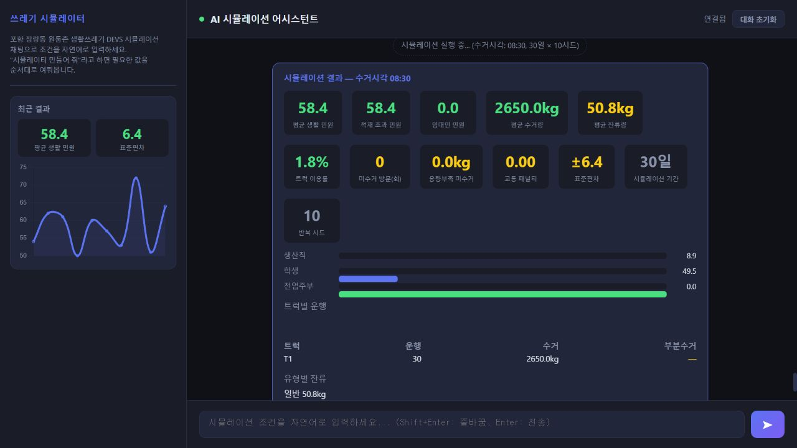
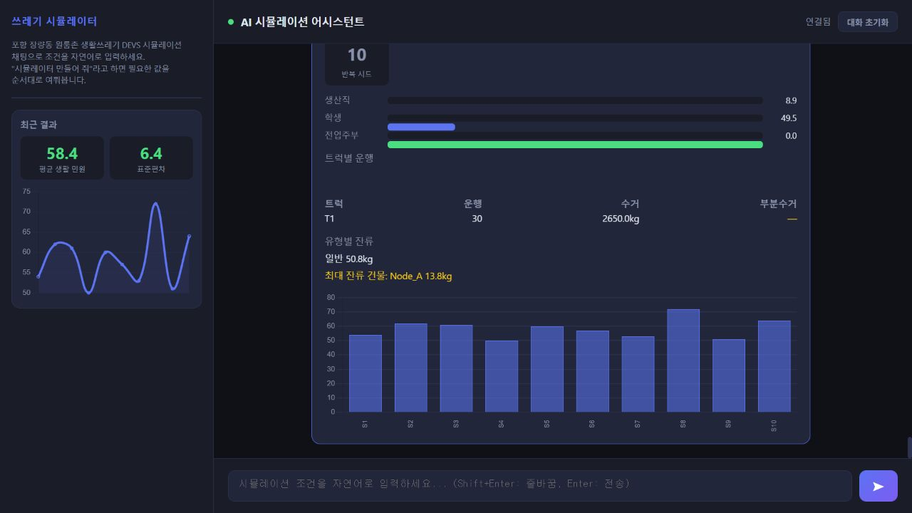

# 서브태스크 v3 실행 화면 기록

2026-09-03 · 로컬 실행 · 기준 커밋 `4005682`

새로 추가된 `jangnyang-simulator-v3.json`에 따라 웹 화면에서 질문에 순서대로 답하고, 구성된 시나리오를 확인한 뒤 실제 Java 시뮬레이션을 실행했다. 입력부터 결과 표시까지 완료했다. 캡처 10장은 실제 앱 화면이며, 예시 입력값은 저장소의 `V3Answers.java` 기준선을 사용하되 실험 목적 문장은 단일 조건 실행에 맞췄다.

## 기준과 실행 환경

- 서브태스크: v3, 총 33개 / 6단계. 수집 31개와 최종 확인 2개로 구성된다.
- 단계별 문항 수: 3 → 5 → 7 → 8 → 7 → 3.
- 원본: `src/main/resources/subtask/jangnyang-simulator-v3.json`
- 파일 SHA-256: `03e17000541fc68799e297e283dfddfa31469226c7bb040d9b5a27316670ea47`
- Java 21.0.10 / Spring Boot 3.2.0 / 앱 1.1.1 / 활성 프로파일 ollama.
- 실행 주소: http://localhost:8090
- 브라우저: Codex 내장 브라우저, 캡처 크기 1280×720.
- 범위: single-run + java + LEGACY_CONSTANT 한 사례의 실제 UI 실행. 다른 엔진·교통 모드·정책 비교 전체를 검증한 것은 아니다.

Maven 래퍼 실행은 로컬 경로 처리 중 `Cannot index into a null array` 오류로 실패했다. 설치된 동일 버전 Maven 3.9.14와 기존 로컬 의존성 저장소를 지정해 서버를 실행했다.

```powershell
# C:\Dev\mcp\waste-sim-spring에서 실행
& C:/Dev/tool/apache-maven-3.9.14/bin/mvn.cmd -o '-Dmaven.repo.local=C:/Users/User/.m2/repository' spring-boot:run
```

## 입력한 조건

| 단계 | 입력값 |
|---|---|
| 1. 실행할 실험 선택 | 목적: 기본 수거 조건에서 생활 민원 발생량 확인 / single-run / java |
| 2. 대상 규모와 주민 설정 | 4동 × 25명 = 100명 / BALANCED / 30일 / 10회 반복 |
| 3. 쓰레기 배출과 수거장 설정 | 0.9kg/인·일 / 배출량 변동 0.3 / 외출시각 표준편차 30분 / PAPER_BASELINE / 수거장 30kg / 민원 임계값 80% |
| 4. 수거 일정과 차량 설정 | 매일 08:30 / LARGE_5TON / 1대 / 초기 적재량 0kg |
| 5. 경로와 교통 설정 | 교통 NONE / LEGACY_CONSTANT / 구간 기본 이동시간 8분 / 자동 방문순서 |
| 6. 설정 확인과 실행 | 기본값 적용 ALL / 시나리오 미리보기 확인 / “이 조건으로 실행” 클릭 |

배출 시간 창, 다회 수거 시각, 차량 수거 가능량 별도 지정, 차량 출발 간격, 교통 프로파일, 지점별 서비스 시간, 구역 내 이동시간, 방문순서 지정은 모두 “해당 없음”으로 답했다. 미리보기에서 민원 임계값이 0.8로 정규화되고, Node_A~Node_D가 자동 생성되는 것을 확인했다.

## 실제 결과

| 항목 | 화면에 표시된 값 |
|---|---:|
| 평균 생활 민원 | 58.4 |
| 표준편차 | 6.4 |
| 적재 초과 민원 | 58.4 |
| 임대인 민원 | 0.0 |
| 평균 수거량 | 2,650.0kg |
| 평균 잔류량 | 50.8kg |
| 트럭 이용률 | 1.8% |
| 미수거 방문 | 0회 |
| 용량부족 미수거 | 0.0kg |
| 교통 패널티 | 0.00 |
| 생산직 / 학생 / 전업주부 민원 | 8.9 / 49.5 / 0.0 |
| 트럭 T1 운행 | 30회 |
| 최대 잔류 건물 | Node_A, 13.8kg |

30일 시뮬레이션을 10개 시드로 반복한 결과다. 민원 58.4는 화면의 평균 지표이며 일평균으로 환산한 수치가 아니다. 단일 수거시각만 실행했으므로 08:30이 최적 시각이라는 결론은 내릴 수 없다.

## 캡처

### 1. 구성 시작
“장량동 원룸촌 시뮬레이터 만들어 줘” 입력 후 1/6단계와 첫 질문이 표시된다.



### 2. 대상 규모와 주민
실험 유형과 엔진 선택 후 건물 수를 묻는 2/6단계로 이동한다.



### 3. 배출량과 수거장
반복 횟수 입력 다음에 3/6단계의 하루 배출량 질문이 표시된다.



### 4. 수거 일정과 차량
4/6단계에서 기준 수거시각을 입력한다.



### 5. 경로와 교통
5/6단계에서 교통 반영 여부를 선택한다.



### 6. 설정 확인
6/6단계에서 서버 기본값 적용 여부를 묻는다.



### 7. 시나리오 미리보기 — 입력값
수집된 값이 single-run / java-devs 시나리오로 조립된다.



### 8. 시나리오 미리보기 — 가정과 실행
자동 생성 지점, 기본 동작에 대한 설명과 실행 버튼을 확인한다.



### 9. 결과 요약
민원, 수거량, 잔류량, 차량 이용률 등 결과 지표가 표시된다.



### 10. 결과 상세
트럭별 운행, 유형별 잔류량과 10개 시드별 차트를 확인한다.



## 관찰한 표시·문서 문제

1. **완료 후에도 미리보기 버튼이 “실행 중...”으로 남는다.** 결과 카드가 이미 도착한 뒤에도 해당 문구와 비활성 상태가 유지된다. 실행이 끝났는지 혼동할 수 있다.
2. **직업별 막대와 텍스트의 정렬이 어긋나 보인다.** 캡처에서 생산직 8.9, 학생 49.5, 전업주부 0.0 옆의 막대 위치가 한 행씩 밀려 보인다. 결과 해석에는 숫자 텍스트를 사용했다. 원인 수정은 수행하지 않았다.
3. **README의 서브태스크 설명이 v2에 머물러 있다.** 50문항·8단계 및 v2 파일 링크가 남아 있지만, 실제 새 세션은 v3의 33개·6단계로 진행된다.
4. **미리보기가 길어 한 화면에 담기지 않는다.** 입력값과 가정·실행 버튼을 두 장으로 나눠 기록했다.

앱 소스는 변경하지 않았으며 이 보고서, PNG 10장, 전체 화면 DOM 기록 `session-dom.txt`만 추가했다.
